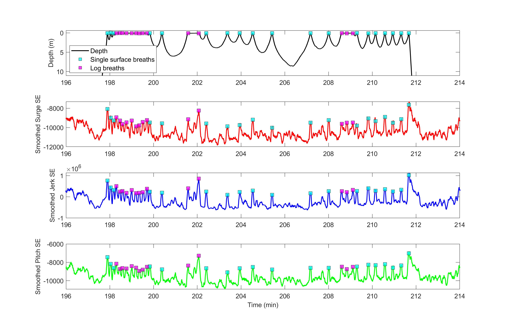
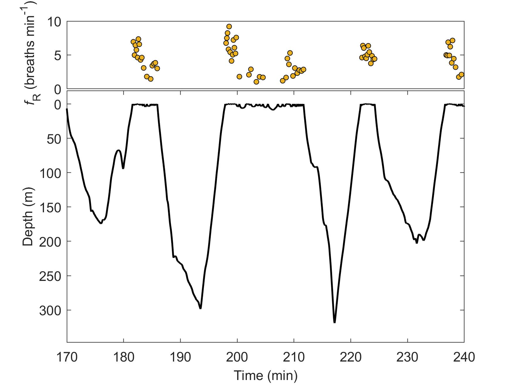

# Summary

Physiological investigations of free-swimming cetaceans have, historically, been limited because of these animals’ large body size and fully aquatic lifestyle [@Block:2005; @Ponganis:2007; @Hooker:2007]. Recent developments in digital bio-logging devices have enabled direct measurements of some physiological parameters in free-swimming cetaceans [@Czapanskiy:2022; @Goldbogen:2019; @Williams:2017], but such investigations remain challenging due to constraints on the design and deployment of these devices. Our ability to measure physiological parameters in free-swimming cetaceans is critical to understanding how these species will respond to disturbance and environmental change. Therefore, development of novel methods to extract physiological information from bio-logging sensors can advance the fields of vertebrate physiology and conservation biology. 

Respiratory parameters, including respiratory rate, are of particular interest in understanding the diving physiology of cetaceans because of their role in determining gas exchange and, therefore, the oxygen supply that supports breath-hold diving. Previous studies have determined respiratory rate of free-swimming cetaceans by direct observation [@Sumich:1983; @Blix:1995; @Williams:2009; @Christansen;2014], from acoustic signals in tags equipped with hydrophones [@Goldbogen:2008], and from patterns in the pitch and depth signals in accelerometry tags [@Miller:2010; @Roos:2016;, @Goldbogen:2008]). These methods are viable in some species, particularly those for which a breath is taken during each surfacing event, but they are not applicable for others that exhibit long periods of time at the surface (i.e., logging) with multiple breathing events, such as short-finned pilot whales. 

Here, I present `respdetect`, a set of Matlab tools to detect breathing events from high-resolution movement data recorded by digital acoustic recording tags (DTAGs). This novel method takes advantage of the high flow rates and large tidal volumes that are typical of cetacean breaths and detects the movement artifacts resulting from a breathing event. The method employs several signal processing steps followed by peak detection based on [@ Czapanskiy:2022]’s method for ballistocardiography from accelerometer data collected from blue whales to derive movement parameters from acceleration and pitch data and identify movement artifacts associated with respirations. The library of functions associated with resp_detect allow users to identify all breaths in the tag record and export the timing of each breath.

`Respdetect` is intended to be used with existing DTAG processing tools developed by Mark Johnson. These tools require the same folder structure necessary for DTAG data processing. A DTAG record should be processed by exporting the prh.m file which contains the accelerometer and magentometer data transformed into the whale frame, as well as the animal’s pitch, roll, and heading. To use resp_detect tools, the user is asked to specify the deployment prh files to analyze. After identifying dives and calculating movement parameters, the user then executes the breath detector which will identify all breathing events in the tag record.

Following detection, the tools allow the user to visualize the respiratory rate time series before exporting the timing of each breath, in addition to several other relevant dive parameters, in a .mat file. An .Rmd file is available with code for plotting the respiration data as it relates to other dive parameters.

The resp_detect workflow also allows users to incorporate acoustic data into their analysis. Using the acoustic auditing tools made available in the existing DTAG Matlab tools users can mark acoustic breath detections and compare the timing of the breath detections from the movement sensors against the acoustic detections. This may be helpful in cases of uncertainty or to determine other respiratory variables when possible (i.e., duration of a breath or amplitude/dB of a breath).

Currently, these tools are being used to detect breaths from DTAGs deployed on short-finned pilot whales, but the tools should be useful for any DTAG record. The best use cases for resp_detect are for DTAGs that were deployed close to the blowhole. 

# Acknowledgements

I would like to acknowledge Drs. Doug Nowacek and Andy Read for their support of this tool development, the Duke Superpod for project feedback and recommendations, Dr. Jeanne Shearer for pre-processing the short-finned pilot whale record used for testing, and Dr. Dave Haas, PMC-BS, and Socioambiental Aonsultores Ltd. for sharing and pre-processing the humpbaack whales record used for testing. This work was supported by the Duke University Marine Laboratory.

# References
